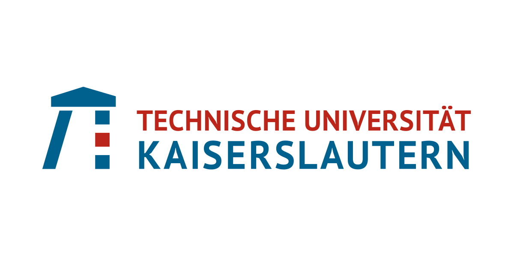

<div id="top"></div>
<!--
*** Thanks for checking out the Best-README-Template. If you have a suggestion
*** that would make this better, please fork the repo and create a pull request
*** or simply open an issue with the tag "enhancement".
*** Don't forget to give the project a star!
*** Thanks again! Now go create something AMAZING! :D
-->


<!-- PROJECT SHIELDS -->
<!--
*** I'm using markdown "reference style" links for readability.
*** Reference links are enclosed in brackets [ ] instead of parentheses ( ).
*** See the bottom of this document for the declaration of the reference variables
*** for contributors-url, forks-url, etc. This is an optional, concise syntax you may use.
*** https://www.markdownguide.org/basic-syntax/#reference-style-links
-->
[![Contributors][contributors-shield]][contributors-url]
[![Forks][forks-shield]][forks-url]
[![Stargazers][stars-shield]][stars-url]
[![Issues][issues-shield]][issues-url]
<!--
[![MIT License][license-shield]][license-url]
[![LinkedIn][linkedin-shield]][linkedin-url]
-->


<!-- PROJECT LOGO -->
<br />
<div align="center">
  <a href="https://github.com/velidurmuscan/VDSProject_Group6">
    
  </a>

  <h3 align="center">
  VDS Class Project
  <br />
  Group #6
  <br />
  Winter Semester 2021/2022
  </h3>

  <p align="center">
    GitHub repository for Verification of Digital Systems Class Project
    <br />
    <a href="https://github.com/velidurmuscan/VDSProject_Group6"><strong>Explore the docs »</strong></a>
    <br />
    <br />
    <a href="https://github.com/velidurmuscan/VDSProject_Group6">View Demo</a>
    ·
    <a href="https://github.com/velidurmuscan/VDSProject_Group6/issues">Report Bug</a>
    ·
    <a href="https://github.com/velidurmuscan/VDSProject_Group6/issues">Request Feature</a>
  </p>
</div>


<br />
<br />


<!-- TABLE OF CONTENTS -->
<details>
  <summary>Table of Contents</summary>
  <ol>
    <li>
      <a href="#about-the-project">About The Project</a>
      <ul>
        <li><a href="#built-with">Built With</a></li>
      </ul>
    </li>
    <li>
      <a href="#getting-started">Getting Started</a>
      <ul>
        <li><a href="#prerequisites">Prerequisites</a></li>
        <li><a href="#installation">Installation</a></li>
      </ul>
    </li>
    <li><a href="#usage">Usage</a></li>
    <li><a href="#roadmap">Roadmap</a></li>
    <li><a href="#contributing">Contributing</a></li>
    <li><a href="#license">License</a></li>
    <li><a href="#contact">Contact</a></li>
    <li><a href="#acknowledgments">Acknowledgments</a></li>
  </ol>
</details>


<!-- ABOUT THE PROJECT -->
## About The Project
In the course of this Lab assignment students are going to implement a minimal BDD package in C++. This package implements the fundamental manipulation methods for ROBDDs as they were introduced in the lecture Verification of Digital Systems by Prof. Kunz. The package will be implemented using the Test Driven Development (TDD) paradigm presented by Dr. Wedler.

The project is split into three parts:
<p align="right">(<a href="#top">back to top</a>)</p>

#### Part1:
Implementation of the basic functionality of the BDD package using the TDD methodology. This is the biggest part of the project.

Main tasks in this part:
* Set up and maintain a Git repository
* Use CMake as a build system of the project
* Verify the code using GTest
* Set up a Continuous Integration (CI) pipeline with GitHub Actions
* Use Doxygen (or a similar tool) to generate documentation for the API. _(Optional)_
<p align="right">(<a href="#top">back to top</a>)</p>

#### Part2:
Improvement of the performance of the implementation via provided benchmarks.

Main tasks in this part:
* Learning how to identify performance bottlenecks within the code.
* Analyzing benchmark results.
* How to overcome bottlenecks.
<p align="right">(<a href="#top">back to top</a>)</p>

#### Part3:
Extending the existing implementation by a practical application of BDD. Using BDDs, it is possible to symbolically represent a state-space. This representation allows to check quickly, whether a specific state is within the reachable state space or not.

<!--
[![Product Name Screen Shot][product-screenshot]](https://example.com)

There are many great README templates available on GitHub; however, I didn't find one that really suited my needs so I created this enhanced one. I want to create a README template so amazing that it'll be the last one you ever need -- I think this is it.

Here's why:
* Your time should be focused on creating something amazing. A project that solves a problem and helps others
* You shouldn't be doing the same tasks over and over like creating a README from scratch
* You should implement DRY principles to the rest of your life :smile:

Of course, no one template will serve all projects since your needs may be different. So I'll be adding more in the near future. You may also suggest changes by forking this repo and creating a pull request or opening an issue. Thanks to all the people have contributed to expanding this template!

Use the `BLANK_README.md` to get started.
-->
<p align="right">(<a href="#top">back to top</a>)</p>


### Built With

* [WSL](https://docs.microsoft.com/en-us/windows/wsl/install)

_Will be updated later._

<!--
This section should list any major frameworks/libraries used to bootstrap your project. Leave any add-ons/plugins for the acknowledgements section. Here are a few examples.

* [Next.js](https://nextjs.org/)
* [React.js](https://reactjs.org/)
* [Vue.js](https://vuejs.org/)
* [Angular](https://angular.io/)
* [Svelte](https://svelte.dev/)
* [Laravel](https://laravel.com)
* [Bootstrap](https://getbootstrap.com)
* [JQuery](https://jquery.com)
-->
<p align="right">(<a href="#top">back to top</a>)</p>


<!-- GETTING STARTED -->
## Getting Started

_Will be updated later._
<!--
This is an example of how you may give instructions on setting up your project locally.
To get a local copy up and running follow these simple example steps.
-->
<p align="right">(<a href="#top">back to top</a>)</p>

### Prerequisites

_Will be updated later._
<!--
This is an example of how to list things you need to use the software and how to install them.
* npm
  ```sh
  npm install npm@latest -g
  ```
-->
<p align="right">(<a href="#top">back to top</a>)</p>

### Installation

_Will be updated later._
<!--
_Below is an example of how you can instruct your audience on installing and setting up your app. This template doesn't rely on any external dependencies or services._

1. Get a free API Key at [https://example.com](https://example.com)
2. Clone the repo
   ```sh
   git clone https://github.com/your_username_/Project-Name.git
   ```
3. Install NPM packages
   ```sh
   npm install
   ```
4. Enter your API in `config.js`
   ```js
   const API_KEY = 'ENTER YOUR API';
   ```
-->
<p align="right">(<a href="#top">back to top</a>)</p>


<!-- USAGE EXAMPLES -->
## Usage

_Will be updated later._
<!--
Use this space to show useful examples of how a project can be used. Additional screenshots, code examples and demos work well in this space. You may also link to more resources.

_For more examples, please refer to the [Documentation](https://example.com)_
-->
<p align="right">(<a href="#top">back to top</a>)</p>


<!-- ROADMAP -->
## Roadmap
#### Part-1
- [X] README implementation
- [X] CI reading&understanding
- [X] ROBDD algorithm reading&understanding
- [X] C++ functions reading&understanding
- [X] How to write basic test functions in C++ properly
- [X] Doxygen reading&understanding
- [X] Google Test reading&understanding
- [ ] ~~Doxygen implementation~~
- [X] CI implementation
- [X] Function implementations
- [X] Test code implementations
- [X] Google Test implementation
<p align="right">(<a href="#top">back to top</a>)</p>

#### Part-2
- [X] Setting up new file directory in the project files
- [X] Installing WSL
- [X] Setting up Boost library via WSL integration
- [X] Understanding the scientific paper (Brace et al., 1990)
- [X] Implementing hashed tables in C++
- [X] Successful benchmarks results
- [X] Successful verification results
- [X] README update
<p align="right">(<a href="#top">back to top</a>)</p>

#### Part-3
- [X] Setting up new file directory in the project files
- [X] Implementation of tests
- [X] Implementation of functions
- [X] Successful test results
- [X] README update
<p align="right">(<a href="#top">back to top</a>)</p>


See the [open issues](https://github.com/velidurmuscan/VDSProject_Group6/issues) for a full list of proposed features (and known issues).

<p align="right">(<a href="#top">back to top</a>)</p>


<!-- CONTRIBUTING -->
## Contributing

Contributions are what make the open source community such an amazing place to learn, inspire, and create. Any contributions you make are **greatly appreciated**.

If you have a suggestion that would make this better, please fork the repo and create a pull request. You can also simply open an issue with the tag "enhancement".
Don't forget to give the project a star! Thanks again!

1. Fork the Project
2. Create your Feature Branch (`git checkout -b feature/AmazingFeature`)
3. Commit your Changes (`git commit -m 'Add some AmazingFeature'`)
4. Push to the Branch (`git push origin feature/AmazingFeature`)
5. Open a Pull Request

<p align="right">(<a href="#top">back to top</a>)</p>


<!-- LICENSE -->
## License

_Will be updated later._
<!--
Distributed under the MIT License. See `LICENSE.txt` for more information.
-->
<p align="right">(<a href="#top">back to top</a>)</p>


<!-- CONTACT -->
## Contact

<!-- Your Name - [@your_twitter](https://twitter.com/your_username) - email@example.com -->
Veli Durmuşcan - durmusc@rhrk.uni-kl.de

Shreya Vithal Kulhalli - kulhalli@rhrk.uni-kl.de

Osama Omar Youssif Ayoub - ayoub@rhrk.uni-kl.de

<!-- Project Link: [https://github.com/your_username/repo_name](https://github.com/your_username/repo_name) -->
[Project Link](https://github.com/velidurmuscan/VDSProject_Group6)

<p align="right">(<a href="#top">back to top</a>)</p>


<!-- ACKNOWLEDGMENTS -->
## Acknowledgments

You might find helpful links below.

### Project Related Resources

#### Given Task Links

* [Google Test](https://github.com/google/googletest)
* [GitHub CI Interactive Tutorial](https://lab.github.com/githubtraining/github-actions:-hello-world)
* [Documenting C++ Code](https://developer.lsst.io/cpp/api-docs.html)
* [Doxygen Examples](https://www.doxygen.nl/results.html)

<p align="right">(<a href="#top">back to top</a>)</p>

#### Additional Materials

* [README Template](https://github.com/othneildrew/Best-README-Template)
* [Travis CI Examples](https://github.com/deftio/travis-ci-cpp-example)

<p align="right">(<a href="#top">back to top</a>)</p>

### General Resources

* [GitHub Emoji Cheat Sheet](https://www.webpagefx.com/tools/emoji-cheat-sheet)
* [Img Shields](https://shields.io)
* [GitHub Pages](https://pages.github.com)
* [Font Awesome](https://fontawesome.com)
* [React Icons](https://react-icons.github.io/react-icons/search)
* [WSL Integration for CLion](https://www.jetbrains.com/help/clion/how-to-use-wsl-development-environment-in-product.html#wsl-tooclhain)
* [How to install Boost library in Ubuntu](https://stackoverflow.com/questions/12578499/how-to-install-boost-on-ubuntu)

<p align="right">(<a href="#top">back to top</a>)</p>


<!-- MARKDOWN LINKS & IMAGES -->
<!-- https://www.markdownguide.org/basic-syntax/#reference-style-links -->
[contributors-shield]: https://img.shields.io/github/contributors/velidurmuscan/VDSProject_Group6.svg?style=for-the-badge
[contributors-url]: https://github.com/velidurmuscan/VDSProject_Group6/graphs/contributors
[forks-shield]: https://img.shields.io/github/forks/velidurmuscan/VDSProject_Group6.svg?style=for-the-badge
[forks-url]: https://github.com/velidurmuscan/VDSProject_Group6/network/members
[stars-shield]: https://img.shields.io/github/stars/velidurmuscan/VDSProject_Group6.svg?style=for-the-badge
[stars-url]: https://github.com/velidurmuscan/VDSProject_Group6/stargazers
[issues-shield]: https://img.shields.io/github/issues/velidurmuscan/VDSProject_Group6.svg?style=for-the-badge
[issues-url]: https://github.com/velidurmuscan/VDSProject_Group6/issues
<!--
[license-shield]: https://img.shields.io/github/license/othneildrew/Best-README-Template.svg?style=for-the-badge
[license-url]: https://github.com/othneildrew/Best-README-Template/blob/master/LICENSE.txt
[linkedin-shield]: https://img.shields.io/badge/-LinkedIn-black.svg?style=for-the-badge&logo=linkedin&colorB=555
[linkedin-url]: https://linkedin.com/in/othneildrew
-->
[product-screenshot]: images/screenshot.png
